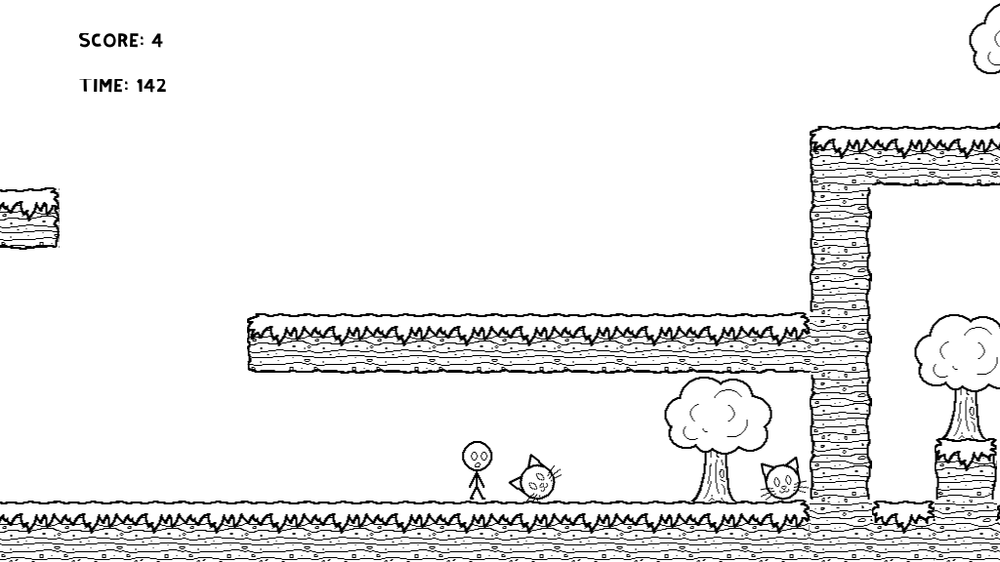
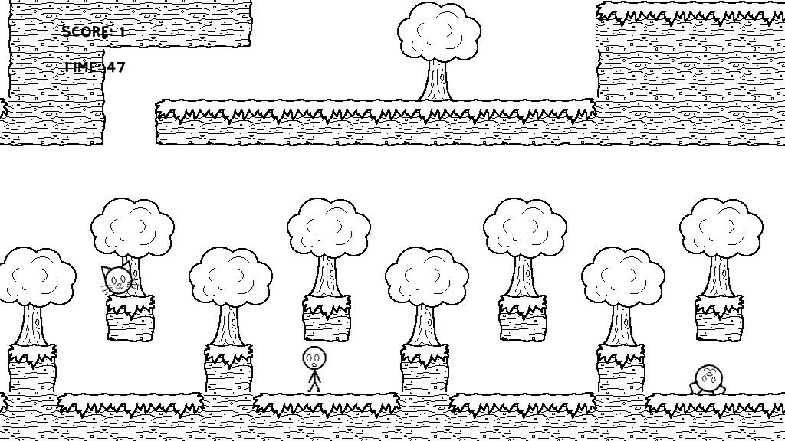

# Cat Collector
A game about shaking cats out of trees.

## About
Cat Collector was created for Global Game Jam 2021. It was created using Godot 3.2.3.

## License
Cat Collector is released under a CC BY-NC-SA liscense.

## Installing
Navigate to [the release page on Github](https://github.com/NimbleClint/gameJam2021/releases) and download the appropriate .zip file for your operating system. Unzip the file and run the executable inside.

## How to play
Ms. Jenkins lost all her cats. Go get them. Avoid the dogs.

A/D or Left/Right arrows: Move left and right
W or Up arrow: Jump
S, Down arrow, or space: Shake a tree
