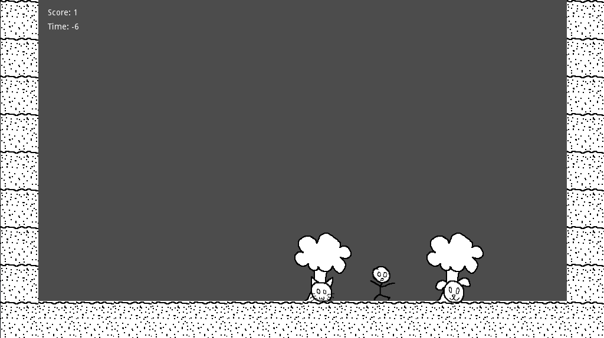

# Game Jam 2021 Document

## Basic Concept
The player must find all the lost cats hiding in the trees within the time limit. The player finds cats by approaching trees and shaking them. Each cat is worth one point. However, dogs may also fall from the trees. If the player collects a dog, they lose three points. The game ends after the time limit.

## To Do
* Basic logic
* Basic UI (Start/End)
* Level Design
* Assets Beautification
* Sound

### Logic Components
> ~~Player~~  
>> ~~Movement~~  
>>> ~~Gravity~~  
>>> ~~Input~~  
>>>> ~~Move left/right~~  
>>>> ~~Jump~~  
  
> ~~Collectables~~  
>> ~~Cats~~  
>> ~~Increase points by one~~  
>> ~~Dogs~~  
>> ~~Decrese points by three~~  
        
> Environment  
>> Level Design  
>> ~~Collisions~~  
>> ~~Canvas follows camera~~  
  
> ~~Interactables~~  
>> ~~Trees~~  
>> ~~On interact:~~  
>>> ~~Spawn either cat or dogs~~  

> ~~Game~~ 
>> ~~Score display~~  
>> ~~Start Screen~~  
>> ~~Timer~~  
>> ~~Upon timer end:~~  
>>> ~~Display Final score~~  

### Assets
* Player
* Cat
* Dog
* Trees
* Ground Tiles
* Wall Tile
* Background
* Start UI
* End UI

### Sound
* Cat sound
* Dog sound
* Tree sound
* Background music
* Ending music

    
## Aesthetics
Pixel art, minimal, possibly black/white
